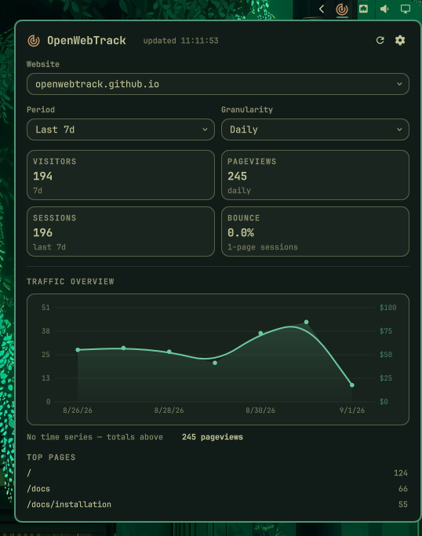

# OpenWebTrack

Shows visitors / pageviews in the bar, with a details panel for website selection, period/granularity, bounce/sessions, time-series graph, top pages and referrers.




## Install

```sh
omarchy plugin add https://github.com/openwebtrack/omarchy-plugin.git --enable
```

## Configure

Set in the panel (Setup card) or in `~/.config/omarchy/shell.json` under `openwebtrack.omarchy-plugin`:

* `instanceUrl` — base URL of your OpenWebTrack instance (e.g. `http://localhost:8424`)
* `mcpKey` — account MCP key `owt_mcp_...` from `/account/mcp` (recommended, encrypted with machine-id)
* `sitesJson` — fallback per-site JSON array `[{"id":"uuid","name":"example.com","apiKey":"owt_..."}]`
* `period` / `granularity` / `refreshIntervalSec`

## Remove

```sh
omarchy plugin remove openwebtrack.omarchy-plugin
```

## License

MIT — see `LICENSE`.
